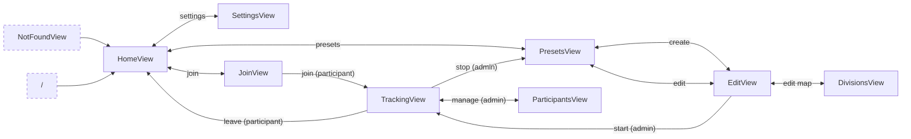

# User Interface

Here, the approximate screens for both frontends are documented.
These mockups are meant to transport the basic ideas of the ui.
Actual positioning, colors and spacing may differ.

## View Flow



## Home View


## Presets View


## Create/Edit Collection View


## Create/Edit Collection Divisions View

```js
availableColors = ["#1E90FF", "#FF1493", "#32CD32", "#FF8C00", "#4B0082"];
```


## Join View


## Tracking View


## Participant Management View


