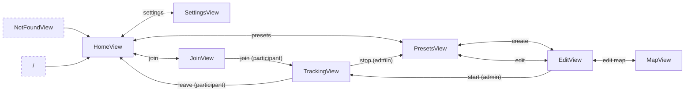

# User Interface

Here, the approximate screens for both frontends are documented.
These are mockups, so actual positioning, colors and spacing may differ.

## View Flow

## Start Screen

## Collection Management

## Collection Form

## Join Collection

## Tracking

## Participant Management

